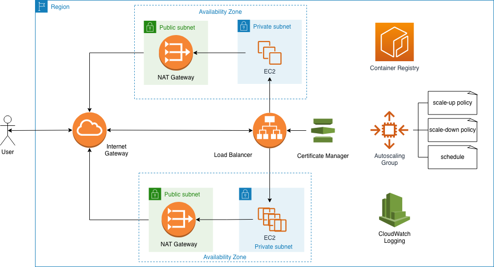

# ec2

## Setup

You need to copy a public key (`id_rsa.pub`) into this folder. This allows you
to remotely log in to the ec2 instance with your corresponding private key.

## EC2 Architecture

<!-- BEGIN_TF_DOCS -->
## Requirements

| Name | Version |
|------|---------|
|  [terraform](#requirement\_terraform) | >= 1.0 |
|  [aws](#requirement\_aws) | >= 4.0.0, < 5.0 |

## Providers

| Name | Version |
|------|---------|
|  [aws](#provider\_aws) | 4.10.0 |
|  [template](#provider\_template) | 2.2.0 |

## Modules

No modules.

## Resources

| Name | Type |
|------|------|
| [aws_alb_target_group.albtargetgrp](https://registry.terraform.io/providers/hashicorp/aws/latest/docs/resources/alb_target_group) | resource |
| [aws_autoscaling_attachment.asgattachment](https://registry.terraform.io/providers/hashicorp/aws/latest/docs/resources/autoscaling_attachment) | resource |
| [aws_autoscaling_group.asg](https://registry.terraform.io/providers/hashicorp/aws/latest/docs/resources/autoscaling_group) | resource |
| [aws_autoscaling_policy.scale_down](https://registry.terraform.io/providers/hashicorp/aws/latest/docs/resources/autoscaling_policy) | resource |
| [aws_autoscaling_policy.scale_up](https://registry.terraform.io/providers/hashicorp/aws/latest/docs/resources/autoscaling_policy) | resource |
| [aws_autoscaling_schedule.schedules](https://registry.terraform.io/providers/hashicorp/aws/latest/docs/resources/autoscaling_schedule) | resource |
| [aws_cloudwatch_log_group.log_groups](https://registry.terraform.io/providers/hashicorp/aws/latest/docs/resources/cloudwatch_log_group) | resource |
| [aws_cloudwatch_metric_alarm.scale_down_alarm](https://registry.terraform.io/providers/hashicorp/aws/latest/docs/resources/cloudwatch_metric_alarm) | resource |
| [aws_cloudwatch_metric_alarm.scale_up_alarm](https://registry.terraform.io/providers/hashicorp/aws/latest/docs/resources/cloudwatch_metric_alarm) | resource |
| [aws_default_route_table.l42_rtprv](https://registry.terraform.io/providers/hashicorp/aws/latest/docs/resources/default_route_table) | resource |
| [aws_eip.nat](https://registry.terraform.io/providers/hashicorp/aws/latest/docs/resources/eip) | resource |
| [aws_iam_instance_profile.asg](https://registry.terraform.io/providers/hashicorp/aws/latest/docs/resources/iam_instance_profile) | resource |
| [aws_iam_role.asg](https://registry.terraform.io/providers/hashicorp/aws/latest/docs/resources/iam_role) | resource |
| [aws_iam_role_policy.asg](https://registry.terraform.io/providers/hashicorp/aws/latest/docs/resources/iam_role_policy) | resource |
| [aws_internet_gateway.l42_igw](https://registry.terraform.io/providers/hashicorp/aws/latest/docs/resources/internet_gateway) | resource |
| [aws_key_pair.keypair](https://registry.terraform.io/providers/hashicorp/aws/latest/docs/resources/key_pair) | resource |
| [aws_launch_configuration.asg](https://registry.terraform.io/providers/hashicorp/aws/latest/docs/resources/launch_configuration) | resource |
| [aws_lb.alb](https://registry.terraform.io/providers/hashicorp/aws/latest/docs/resources/lb) | resource |
| [aws_lb_listener.front_end_http](https://registry.terraform.io/providers/hashicorp/aws/latest/docs/resources/lb_listener) | resource |
| [aws_lb_listener.front_end_https](https://registry.terraform.io/providers/hashicorp/aws/latest/docs/resources/lb_listener) | resource |
| [aws_nat_gateway.l42_main](https://registry.terraform.io/providers/hashicorp/aws/latest/docs/resources/nat_gateway) | resource |
| [aws_route_table.l42_rtpub](https://registry.terraform.io/providers/hashicorp/aws/latest/docs/resources/route_table) | resource |
| [aws_route_table.private](https://registry.terraform.io/providers/hashicorp/aws/latest/docs/resources/route_table) | resource |
| [aws_route_table_association.l42_rtpubassoc](https://registry.terraform.io/providers/hashicorp/aws/latest/docs/resources/route_table_association) | resource |
| [aws_route_table_association.private](https://registry.terraform.io/providers/hashicorp/aws/latest/docs/resources/route_table_association) | resource |
| [aws_security_group.alb](https://registry.terraform.io/providers/hashicorp/aws/latest/docs/resources/security_group) | resource |
| [aws_security_group.l42_sg](https://registry.terraform.io/providers/hashicorp/aws/latest/docs/resources/security_group) | resource |
| [aws_subnet.l42_subprv](https://registry.terraform.io/providers/hashicorp/aws/latest/docs/resources/subnet) | resource |
| [aws_subnet.l42_subpub](https://registry.terraform.io/providers/hashicorp/aws/latest/docs/resources/subnet) | resource |
| [aws_vpc.l42_vpc](https://registry.terraform.io/providers/hashicorp/aws/latest/docs/resources/vpc) | resource |
| [aws_ami.amazon_linux_2](https://registry.terraform.io/providers/hashicorp/aws/latest/docs/data-sources/ami) | data source |
| [aws_availability_zones.available](https://registry.terraform.io/providers/hashicorp/aws/latest/docs/data-sources/availability_zones) | data source |
| [aws_caller_identity.current](https://registry.terraform.io/providers/hashicorp/aws/latest/docs/data-sources/caller_identity) | data source |
| [template_file.user_data_file](https://registry.terraform.io/providers/hashicorp/template/latest/docs/data-sources/file) | data source |

## Inputs

| Name | Description | Type | Default | Required |
|------|-------------|------|---------|:--------:|
|  [certificate\_arn](#input\_certificate\_arn) | Certificate ARN | `string` | n/a | yes |
|  [region](#input\_region) | AWS region | `string` | n/a | yes |

## Outputs

| Name | Description |
|------|-------------|
|  [alb\_dns](#output\_alb\_dns) | compute |
|  [user\_data\_rendered](#output\_user\_data\_rendered) | n/a |
<!-- END_TF_DOCS -->
