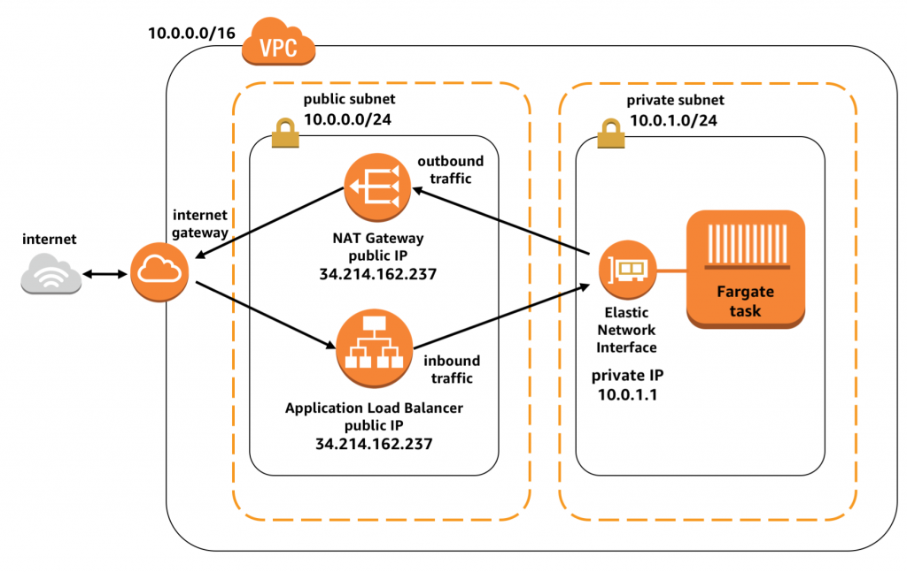

# Using Amazon ECS Fargate to run L42 in containers

## ECS Fargate Architecture


The HTTPS encryption will take place between your external clients (anyone in the internet) and the load balancer, and the load balancer nodes will communicate to your Fargate tasks over HTTP using their private IP addresses.

HTTPS requires an SSL certificate, hence you would need to either create or purchase an SSL certificate. Valid SSL certificates require DNS, however you can use a self-signed SSL certificate (the traffic will be encrypted but you would receive a warning when attempting to connect to the load balancer over HTTPS). Here we are using AWS Certificate Manager to generate and store a certificate for our domain.

To achieve High Availability, load balancers always need at least two public subnets.
Containers can be run in tasks across multiple Availability Zones (i.e. our private subnets), the solution would also work with just one private subnet.

## Debug ECS Tasks

You can now remote into a running ECS task (i.e. container), details can be found [here](https://aws.amazon.com/blogs/containers/new-using-amazon-ecs-exec-access-your-containers-fargate-ec2/
).

## Resources

+ VPC (Virtual Private Cloud) with two public and private subnets, internet gateway, route tables and NAT gateway with EIP
+ ECS Fargate cluster with a [task definition](<https://docs.aws.amazon.com/AmazonECS/latest/developerguide/task_definitions.html>) to specify the container it wants to run.
+ [ECS Service](<https://docs.aws.amazon.com/AmazonECS/latest/developerguide/ecs_services.html>)
+ Auto-scaling target
+ Task Execution Role which is the IAM role that executes ECS actions such as pulling the image and storing the application logs in CloudWatch
+ Task Role which is the IAM role used by the task (= container) itself, so we have to give the task the IAM permission the container needs to fulfill his job
+ CloudWatch Log Group
+ Load balancer
+ Https listener (attached to load balancer) to forward traffic to container
+ Http listener to redirect traffic to https listener
+ Various service endpoints to keep the traffic private
+ Various security groups to act as a virtual firewall


If you just need http and not https, rename two files:

+ lb-http.tf.bak --> lb-http.tf
+ lb-https.tf --> lb-https.tf.bak

## Setup

+ build and push application container to a new Elastic Container Repository (see README.md in L42-docker folder)

+ deploy all resources with Terraform

```bash

# Customise these parameters:

(
    echo 'region                      = "ap-southeast-2"'
    echo 'ecs_autoscale_min_instances = 1'
    echo 'ecs_autoscale_max_instances = 2'
    echo 'container_image             = "307210808327.dkr.ecr.ap-southeast-2.amazonaws.com/l42:latest"'
    echo 'certificate_arn             = "arn:aws:acm:ap-southeast-2:307210808327:certificate/717dd49e-7fed-4f1b-8b4a-7ab38e0e0a8f"'
) >terraform.auto.tfvars
or
(
    echo 'region                      = "eu-west-1"'
    echo 'ecs_autoscale_min_instances = 1'
    echo 'ecs_autoscale_max_instances = 2'
    echo 'container_image             = "094033154904.dkr.ecr.eu-west-1.amazonaws.com/l42:latest"'
    echo 'certificate_arn             = "arn:aws:acm:eu-west-1:094033154904:certificate/f82b38ad-5ff1-4e92-b6f9-fa4e0752cde9"'
) >terraform.auto.tfvars

terraform init
terraform apply
```

Manual steps:

+ add load balancer DNS to Route53 Alias record for <https://aws.flry.net> (takes a few minutes to update DNS)
+ wait until task is in the RUNNING state
+ test application health: <https://aws.flry.net/health>
+ run application: <https://aws.flry.net>

## Teardown

+ remove all resources with Terraform

```Terraform
terraform destroy
```

+ remove ECR in AWS console

## Diagrams



Diagram: *ECS Fargate Container Tasks in Private Subnet, Load Balancer in Public Subnet*


Diagram: *Using multiple Availability Zones to achieve High Availability*

## Requirements

| Name | Version |
|------|---------|
| <a name="requirement_terraform"></a> [terraform](#requirement\_terraform) | >= 1.0 |
| <a name="requirement_aws"></a> [aws](#requirement\_aws) | >= 4.0.0, < 5.0 |

## Providers

| Name | Version |
|------|---------|
| <a name="provider_aws"></a> [aws](#provider\_aws) | 4.0.0 |

## Modules

No modules.

## Resources

| Name | Type |
|------|------|
| [aws_alb.alb](https://registry.terraform.io/providers/hashicorp/aws/latest/docs/resources/alb) | resource |
| [aws_alb_listener.https](https://registry.terraform.io/providers/hashicorp/aws/latest/docs/resources/alb_listener) | resource |
| [aws_alb_target_group.trg](https://registry.terraform.io/providers/hashicorp/aws/latest/docs/resources/alb_target_group) | resource |
| [aws_appautoscaling_target.app_scale_target](https://registry.terraform.io/providers/hashicorp/aws/latest/docs/resources/appautoscaling_target) | resource |
| [aws_cloudwatch_log_group.logs](https://registry.terraform.io/providers/hashicorp/aws/latest/docs/resources/cloudwatch_log_group) | resource |
| [aws_default_route_table.rtprv](https://registry.terraform.io/providers/hashicorp/aws/latest/docs/resources/default_route_table) | resource |
| [aws_ecs_cluster.app](https://registry.terraform.io/providers/hashicorp/aws/latest/docs/resources/ecs_cluster) | resource |
| [aws_ecs_service.app](https://registry.terraform.io/providers/hashicorp/aws/latest/docs/resources/ecs_service) | resource |
| [aws_ecs_task_definition.app](https://registry.terraform.io/providers/hashicorp/aws/latest/docs/resources/ecs_task_definition) | resource |
| [aws_eip.nat](https://registry.terraform.io/providers/hashicorp/aws/latest/docs/resources/eip) | resource |
| [aws_iam_role.ecs_task_execution_role](https://registry.terraform.io/providers/hashicorp/aws/latest/docs/resources/iam_role) | resource |
| [aws_iam_role.ecs_task_role](https://registry.terraform.io/providers/hashicorp/aws/latest/docs/resources/iam_role) | resource |
| [aws_iam_role_policy.ecs_task_policy](https://registry.terraform.io/providers/hashicorp/aws/latest/docs/resources/iam_role_policy) | resource |
| [aws_iam_role_policy_attachment.ecs_task_execution_role_policy](https://registry.terraform.io/providers/hashicorp/aws/latest/docs/resources/iam_role_policy_attachment) | resource |
| [aws_internet_gateway.igw](https://registry.terraform.io/providers/hashicorp/aws/latest/docs/resources/internet_gateway) | resource |
| [aws_lb_listener.http](https://registry.terraform.io/providers/hashicorp/aws/latest/docs/resources/lb_listener) | resource |
| [aws_nat_gateway.main](https://registry.terraform.io/providers/hashicorp/aws/latest/docs/resources/nat_gateway) | resource |
| [aws_route_table.private](https://registry.terraform.io/providers/hashicorp/aws/latest/docs/resources/route_table) | resource |
| [aws_route_table.rtpub](https://registry.terraform.io/providers/hashicorp/aws/latest/docs/resources/route_table) | resource |
| [aws_route_table_association.private](https://registry.terraform.io/providers/hashicorp/aws/latest/docs/resources/route_table_association) | resource |
| [aws_route_table_association.rtpubassoc](https://registry.terraform.io/providers/hashicorp/aws/latest/docs/resources/route_table_association) | resource |
| [aws_security_group.sg_alb](https://registry.terraform.io/providers/hashicorp/aws/latest/docs/resources/security_group) | resource |
| [aws_security_group.sg_task](https://registry.terraform.io/providers/hashicorp/aws/latest/docs/resources/security_group) | resource |
| [aws_security_group.vpce](https://registry.terraform.io/providers/hashicorp/aws/latest/docs/resources/security_group) | resource |
| [aws_security_group_rule.ingress_alb_http](https://registry.terraform.io/providers/hashicorp/aws/latest/docs/resources/security_group_rule) | resource |
| [aws_security_group_rule.ingress_alb_https](https://registry.terraform.io/providers/hashicorp/aws/latest/docs/resources/security_group_rule) | resource |
| [aws_security_group_rule.sg_alb_egress_rule_task](https://registry.terraform.io/providers/hashicorp/aws/latest/docs/resources/security_group_rule) | resource |
| [aws_security_group_rule.sg_task_egress_rule](https://registry.terraform.io/providers/hashicorp/aws/latest/docs/resources/security_group_rule) | resource |
| [aws_security_group_rule.sg_task_ingress_rule](https://registry.terraform.io/providers/hashicorp/aws/latest/docs/resources/security_group_rule) | resource |
| [aws_security_group_rule.vpce_egress_rule](https://registry.terraform.io/providers/hashicorp/aws/latest/docs/resources/security_group_rule) | resource |
| [aws_security_group_rule.vpce_ingress_rule](https://registry.terraform.io/providers/hashicorp/aws/latest/docs/resources/security_group_rule) | resource |
| [aws_subnet.subprv](https://registry.terraform.io/providers/hashicorp/aws/latest/docs/resources/subnet) | resource |
| [aws_subnet.subpub](https://registry.terraform.io/providers/hashicorp/aws/latest/docs/resources/subnet) | resource |
| [aws_vpc.vpc](https://registry.terraform.io/providers/hashicorp/aws/latest/docs/resources/vpc) | resource |
| [aws_vpc_endpoint.ecr_api](https://registry.terraform.io/providers/hashicorp/aws/latest/docs/resources/vpc_endpoint) | resource |
| [aws_vpc_endpoint.ecr_dkr](https://registry.terraform.io/providers/hashicorp/aws/latest/docs/resources/vpc_endpoint) | resource |
| [aws_vpc_endpoint.events](https://registry.terraform.io/providers/hashicorp/aws/latest/docs/resources/vpc_endpoint) | resource |
| [aws_vpc_endpoint.logs](https://registry.terraform.io/providers/hashicorp/aws/latest/docs/resources/vpc_endpoint) | resource |
| [aws_vpc_endpoint.monitoring](https://registry.terraform.io/providers/hashicorp/aws/latest/docs/resources/vpc_endpoint) | resource |
| [aws_vpc_endpoint.sns](https://registry.terraform.io/providers/hashicorp/aws/latest/docs/resources/vpc_endpoint) | resource |
| [aws_availability_zones.available](https://registry.terraform.io/providers/hashicorp/aws/latest/docs/data-sources/availability_zones) | data source |
| [aws_caller_identity.current](https://registry.terraform.io/providers/hashicorp/aws/latest/docs/data-sources/caller_identity) | data source |
| [aws_elb_service_account.alb](https://registry.terraform.io/providers/hashicorp/aws/latest/docs/data-sources/elb_service_account) | data source |
| [aws_iam_policy_document.assume_role_policy](https://registry.terraform.io/providers/hashicorp/aws/latest/docs/data-sources/iam_policy_document) | data source |
| [aws_region.current](https://registry.terraform.io/providers/hashicorp/aws/latest/docs/data-sources/region) | data source |
| [aws_vpc_endpoint_service.ecr_api](https://registry.terraform.io/providers/hashicorp/aws/latest/docs/data-sources/vpc_endpoint_service) | data source |
| [aws_vpc_endpoint_service.ecr_dkr](https://registry.terraform.io/providers/hashicorp/aws/latest/docs/data-sources/vpc_endpoint_service) | data source |
| [aws_vpc_endpoint_service.events](https://registry.terraform.io/providers/hashicorp/aws/latest/docs/data-sources/vpc_endpoint_service) | data source |
| [aws_vpc_endpoint_service.logs](https://registry.terraform.io/providers/hashicorp/aws/latest/docs/data-sources/vpc_endpoint_service) | data source |
| [aws_vpc_endpoint_service.monitoring](https://registry.terraform.io/providers/hashicorp/aws/latest/docs/data-sources/vpc_endpoint_service) | data source |
| [aws_vpc_endpoint_service.sns](https://registry.terraform.io/providers/hashicorp/aws/latest/docs/data-sources/vpc_endpoint_service) | data source |

## Inputs

| Name | Description | Type | Default | Required |
|------|-------------|------|---------|:--------:|
| <a name="input_certificate_arn"></a> [certificate\_arn](#input\_certificate\_arn) | ARN of the certificate we are using for https://r53.heitland-ite.de | `string` | n/a | yes |
| <a name="input_container_image"></a> [container\_image](#input\_container\_image) | The default docker image to deploy with the infrastructure. | `string` | `"amazon/amazon-ecs-sample"` | no |
| <a name="input_ecs_autoscale_max_instances"></a> [ecs\_autoscale\_max\_instances](#input\_ecs\_autoscale\_max\_instances) | The maximum number of containers that should be running. Used by both autoscale-perf.tf and autoscale.time.tf | `string` | `"2"` | no |
| <a name="input_ecs_autoscale_min_instances"></a> [ecs\_autoscale\_min\_instances](#input\_ecs\_autoscale\_min\_instances) | The minimum number of containers that should be running.<br>  Must be at least 1.<br>  used by both autoscale-perf.tf and autoscale.time.tf<br>  For production, consider using at least "2". | `string` | `"1"` | no |
| <a name="input_region"></a> [region](#input\_region) | AWS region as a deployment target | `string` | n/a | yes |

## Outputs

| Name | Description |
|------|-------------|
| <a name="output_alb_dns"></a> [alb\_dns](#output\_alb\_dns) | n/a |

<!-- BEGIN_TF_DOCS -->
## Requirements

| Name | Version |
|------|---------|
| <a name="requirement_terraform"></a> [terraform](#requirement\_terraform) | >= 1.0 |
| <a name="requirement_aws"></a> [aws](#requirement\_aws) | >= 4.0.0, < 5.0 |

## Providers

| Name | Version |
|------|---------|
| <a name="provider_aws"></a> [aws](#provider\_aws) | 4.9.0 |

## Modules

No modules.

## Resources

| Name | Type |
|------|------|
| [aws_alb.alb](https://registry.terraform.io/providers/hashicorp/aws/latest/docs/resources/alb) | resource |
| [aws_alb_listener.https](https://registry.terraform.io/providers/hashicorp/aws/latest/docs/resources/alb_listener) | resource |
| [aws_alb_target_group.trg](https://registry.terraform.io/providers/hashicorp/aws/latest/docs/resources/alb_target_group) | resource |
| [aws_appautoscaling_target.app_scale_target](https://registry.terraform.io/providers/hashicorp/aws/latest/docs/resources/appautoscaling_target) | resource |
| [aws_cloudwatch_log_group.logs](https://registry.terraform.io/providers/hashicorp/aws/latest/docs/resources/cloudwatch_log_group) | resource |
| [aws_default_route_table.rtprv](https://registry.terraform.io/providers/hashicorp/aws/latest/docs/resources/default_route_table) | resource |
| [aws_ecs_cluster.app](https://registry.terraform.io/providers/hashicorp/aws/latest/docs/resources/ecs_cluster) | resource |
| [aws_ecs_service.app](https://registry.terraform.io/providers/hashicorp/aws/latest/docs/resources/ecs_service) | resource |
| [aws_ecs_task_definition.app](https://registry.terraform.io/providers/hashicorp/aws/latest/docs/resources/ecs_task_definition) | resource |
| [aws_eip.nat](https://registry.terraform.io/providers/hashicorp/aws/latest/docs/resources/eip) | resource |
| [aws_iam_role.ecs_task_execution_role](https://registry.terraform.io/providers/hashicorp/aws/latest/docs/resources/iam_role) | resource |
| [aws_iam_role.ecs_task_role](https://registry.terraform.io/providers/hashicorp/aws/latest/docs/resources/iam_role) | resource |
| [aws_iam_role_policy.ecs_task_policy](https://registry.terraform.io/providers/hashicorp/aws/latest/docs/resources/iam_role_policy) | resource |
| [aws_iam_role_policy_attachment.ecs_task_execution_role_policy](https://registry.terraform.io/providers/hashicorp/aws/latest/docs/resources/iam_role_policy_attachment) | resource |
| [aws_internet_gateway.igw](https://registry.terraform.io/providers/hashicorp/aws/latest/docs/resources/internet_gateway) | resource |
| [aws_lb_listener.http](https://registry.terraform.io/providers/hashicorp/aws/latest/docs/resources/lb_listener) | resource |
| [aws_nat_gateway.main](https://registry.terraform.io/providers/hashicorp/aws/latest/docs/resources/nat_gateway) | resource |
| [aws_route_table.private](https://registry.terraform.io/providers/hashicorp/aws/latest/docs/resources/route_table) | resource |
| [aws_route_table.rtpub](https://registry.terraform.io/providers/hashicorp/aws/latest/docs/resources/route_table) | resource |
| [aws_route_table_association.private](https://registry.terraform.io/providers/hashicorp/aws/latest/docs/resources/route_table_association) | resource |
| [aws_route_table_association.rtpubassoc](https://registry.terraform.io/providers/hashicorp/aws/latest/docs/resources/route_table_association) | resource |
| [aws_security_group.sg_alb](https://registry.terraform.io/providers/hashicorp/aws/latest/docs/resources/security_group) | resource |
| [aws_security_group.sg_task](https://registry.terraform.io/providers/hashicorp/aws/latest/docs/resources/security_group) | resource |
| [aws_security_group.vpce](https://registry.terraform.io/providers/hashicorp/aws/latest/docs/resources/security_group) | resource |
| [aws_security_group_rule.ingress_alb_http](https://registry.terraform.io/providers/hashicorp/aws/latest/docs/resources/security_group_rule) | resource |
| [aws_security_group_rule.ingress_alb_https](https://registry.terraform.io/providers/hashicorp/aws/latest/docs/resources/security_group_rule) | resource |
| [aws_security_group_rule.sg_alb_egress_rule_task](https://registry.terraform.io/providers/hashicorp/aws/latest/docs/resources/security_group_rule) | resource |
| [aws_security_group_rule.sg_task_egress_rule](https://registry.terraform.io/providers/hashicorp/aws/latest/docs/resources/security_group_rule) | resource |
| [aws_security_group_rule.sg_task_ingress_rule](https://registry.terraform.io/providers/hashicorp/aws/latest/docs/resources/security_group_rule) | resource |
| [aws_security_group_rule.vpce_egress_rule](https://registry.terraform.io/providers/hashicorp/aws/latest/docs/resources/security_group_rule) | resource |
| [aws_security_group_rule.vpce_ingress_rule](https://registry.terraform.io/providers/hashicorp/aws/latest/docs/resources/security_group_rule) | resource |
| [aws_subnet.subprv](https://registry.terraform.io/providers/hashicorp/aws/latest/docs/resources/subnet) | resource |
| [aws_subnet.subpub](https://registry.terraform.io/providers/hashicorp/aws/latest/docs/resources/subnet) | resource |
| [aws_vpc.vpc](https://registry.terraform.io/providers/hashicorp/aws/latest/docs/resources/vpc) | resource |
| [aws_vpc_endpoint.ecr_api](https://registry.terraform.io/providers/hashicorp/aws/latest/docs/resources/vpc_endpoint) | resource |
| [aws_vpc_endpoint.ecr_dkr](https://registry.terraform.io/providers/hashicorp/aws/latest/docs/resources/vpc_endpoint) | resource |
| [aws_vpc_endpoint.events](https://registry.terraform.io/providers/hashicorp/aws/latest/docs/resources/vpc_endpoint) | resource |
| [aws_vpc_endpoint.logs](https://registry.terraform.io/providers/hashicorp/aws/latest/docs/resources/vpc_endpoint) | resource |
| [aws_vpc_endpoint.monitoring](https://registry.terraform.io/providers/hashicorp/aws/latest/docs/resources/vpc_endpoint) | resource |
| [aws_vpc_endpoint.sns](https://registry.terraform.io/providers/hashicorp/aws/latest/docs/resources/vpc_endpoint) | resource |
| [aws_availability_zones.available](https://registry.terraform.io/providers/hashicorp/aws/latest/docs/data-sources/availability_zones) | data source |
| [aws_caller_identity.current](https://registry.terraform.io/providers/hashicorp/aws/latest/docs/data-sources/caller_identity) | data source |
| [aws_elb_service_account.alb](https://registry.terraform.io/providers/hashicorp/aws/latest/docs/data-sources/elb_service_account) | data source |
| [aws_iam_policy_document.assume_role_policy](https://registry.terraform.io/providers/hashicorp/aws/latest/docs/data-sources/iam_policy_document) | data source |
| [aws_region.current](https://registry.terraform.io/providers/hashicorp/aws/latest/docs/data-sources/region) | data source |
| [aws_vpc_endpoint_service.ecr_api](https://registry.terraform.io/providers/hashicorp/aws/latest/docs/data-sources/vpc_endpoint_service) | data source |
| [aws_vpc_endpoint_service.ecr_dkr](https://registry.terraform.io/providers/hashicorp/aws/latest/docs/data-sources/vpc_endpoint_service) | data source |
| [aws_vpc_endpoint_service.events](https://registry.terraform.io/providers/hashicorp/aws/latest/docs/data-sources/vpc_endpoint_service) | data source |
| [aws_vpc_endpoint_service.logs](https://registry.terraform.io/providers/hashicorp/aws/latest/docs/data-sources/vpc_endpoint_service) | data source |
| [aws_vpc_endpoint_service.monitoring](https://registry.terraform.io/providers/hashicorp/aws/latest/docs/data-sources/vpc_endpoint_service) | data source |
| [aws_vpc_endpoint_service.sns](https://registry.terraform.io/providers/hashicorp/aws/latest/docs/data-sources/vpc_endpoint_service) | data source |

## Inputs

| Name | Description | Type | Default | Required |
|------|-------------|------|---------|:--------:|
| <a name="input_certificate_arn"></a> [certificate\_arn](#input\_certificate\_arn) | ARN of the certificate we are using for https://r53.heitland-ite.de | `string` | n/a | yes |
| <a name="input_container_image"></a> [container\_image](#input\_container\_image) | The default docker image to deploy with the infrastructure. | `string` | `"amazon/amazon-ecs-sample"` | no |
| <a name="input_ecs_autoscale_max_instances"></a> [ecs\_autoscale\_max\_instances](#input\_ecs\_autoscale\_max\_instances) | The maximum number of containers that should be running. Used by both autoscale-perf.tf and autoscale.time.tf | `string` | `"2"` | no |
| <a name="input_ecs_autoscale_min_instances"></a> [ecs\_autoscale\_min\_instances](#input\_ecs\_autoscale\_min\_instances) | The minimum number of containers that should be running.<br>  Must be at least 1.<br>  used by both autoscale-perf.tf and autoscale.time.tf<br>  For production, consider using at least "2". | `string` | `"1"` | no |
| <a name="input_region"></a> [region](#input\_region) | AWS region as a deployment target | `string` | n/a | yes |

## Outputs

| Name | Description |
|------|-------------|
| <a name="output_alb_dns"></a> [alb\_dns](#output\_alb\_dns) | n/a |
<!-- END_TF_DOCS -->