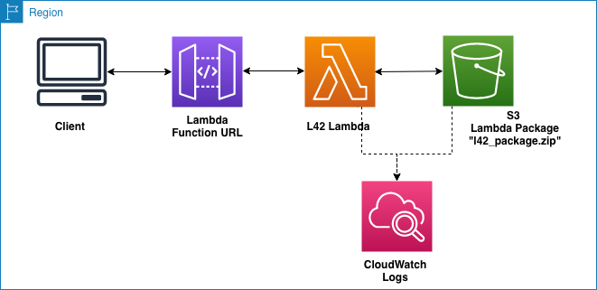

# Lambda Function for 42

## Lambda Architecture



To get started, run these commands:

```bash
(cd .. && make build)
terraform init
cp -f variables.sample.txt terraform.auto.tfvars
terraform apply
```

Terraform returns <api_gateway_base_url> in its output,
run *editor/index.html* in a browser with the following url:

```text
https://printfn.github.io/master-project/editor/?server=https://<api_gateway_base_url>
```

<!-- BEGIN_TF_DOCS -->
## Requirements

| Name | Version |
|------|---------|
| <a name="requirement_terraform"></a> [terraform](#requirement\_terraform) | >=1.0, <2.0 |
| <a name="requirement_aws"></a> [aws](#requirement\_aws) | >=4.2.0, <5.0.0 |

## Providers

| Name | Version |
|------|---------|
| <a name="provider_aws"></a> [aws](#provider\_aws) | 4.9.0 |

## Modules

No modules.

## Resources

| Name | Type |
|------|------|
| [aws_cloudwatch_event_rule.every_ten_minutes](https://registry.terraform.io/providers/hashicorp/aws/latest/docs/resources/cloudwatch_event_rule) | resource |
| [aws_cloudwatch_event_target.keep_lambda_warm](https://registry.terraform.io/providers/hashicorp/aws/latest/docs/resources/cloudwatch_event_target) | resource |
| [aws_cloudwatch_log_group.l42_lambda](https://registry.terraform.io/providers/hashicorp/aws/latest/docs/resources/cloudwatch_log_group) | resource |
| [aws_iam_policy.l42_lambda_logging](https://registry.terraform.io/providers/hashicorp/aws/latest/docs/resources/iam_policy) | resource |
| [aws_iam_role.l42_lambda](https://registry.terraform.io/providers/hashicorp/aws/latest/docs/resources/iam_role) | resource |
| [aws_iam_role_policy_attachment.l42_lambda_logs](https://registry.terraform.io/providers/hashicorp/aws/latest/docs/resources/iam_role_policy_attachment) | resource |
| [aws_lambda_function.l42_lambda](https://registry.terraform.io/providers/hashicorp/aws/latest/docs/resources/lambda_function) | resource |
| [aws_lambda_function_url.l42_lambda_url](https://registry.terraform.io/providers/hashicorp/aws/latest/docs/resources/lambda_function_url) | resource |
| [aws_lambda_permission.allow_cloudwatch_to_call_check_foo](https://registry.terraform.io/providers/hashicorp/aws/latest/docs/resources/lambda_permission) | resource |
| [aws_s3_bucket.l42_bucket](https://registry.terraform.io/providers/hashicorp/aws/latest/docs/resources/s3_bucket) | resource |
| [aws_s3_bucket_acl.l42_bucket](https://registry.terraform.io/providers/hashicorp/aws/latest/docs/resources/s3_bucket_acl) | resource |
| [aws_s3_bucket_public_access_block.l42_bucket](https://registry.terraform.io/providers/hashicorp/aws/latest/docs/resources/s3_bucket_public_access_block) | resource |
| [aws_s3_object.l42_lambda](https://registry.terraform.io/providers/hashicorp/aws/latest/docs/resources/s3_object) | resource |
| [aws_caller_identity.current](https://registry.terraform.io/providers/hashicorp/aws/latest/docs/data-sources/caller_identity) | data source |

## Inputs

| Name | Description | Type | Default | Required |
|------|-------------|------|---------|:--------:|
| <a name="input_aws_region"></a> [aws\_region](#input\_aws\_region) | AWS region for all resources. | `string` | n/a | yes |

## Outputs

| Name | Description |
|------|-------------|
| <a name="output_editor_url"></a> [editor\_url](#output\_editor\_url) | url to launch L42 editor |
<!-- END_TF_DOCS -->